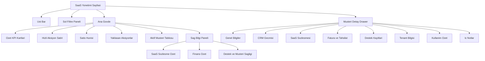

# SaaS Yönetimi Ekrani Bilesen Yerlesim Semasi

Bu dokuman, Eses Yazilim tarafinin gunluk kullanim ana ekrani olacak SaaS Yonetimi sayfasinin birebir yerlesim semasini tanimlar.

## Amac

Bu ekranin ana amaci OSGB operasyonu yonetmek degil, Eses ile OSGB musterileri arasindaki ticari ve operasyonel iliskiyi tek yerden yonetmektir.

Bu nedenle ekranin merkezi nesnesi sunlardir:

1. OSGB adayi
2. Aktif OSGB musterisi
3. SaaS sozlesmesi
4. Abonelik ve tahsilat durumu
5. Destek ve tenant durumu

## Genel Yerlesim

```text
+----------------------------------------------------------------------------------+
| UST BAR: Arama | Hizli Aksiyonlar | Bildirimler | Kullanici | Baglam etiketi     |
+----------------------------------------------------------------------------------+
| SOL FILTRELER  | ANA ICERIK                                                        |
|                |                                                                   |
| - Durum        | 1. Ozet KPI Kartlari                                              |
| - Paket        | 2. Hizli Aksiyon Satiri                                           |
| - Tahsilat     | 3. Satıs Hunisi + Yaklasan Aksiyonlar                             |
| - Destek       | 4. Aktif Musteri Tablosu                                          |
| - Yenileme     | 5. Sag Panel: Sozlesme / Finans / Destek Sagligi                  |
| - Etiketler    |                                                                   |
+----------------------------------------------------------------------------------+
| ALT DETAY ALANI / DRAWER: Musteri detayi, ic notlar, fatura, tenant, destek      |
+----------------------------------------------------------------------------------+
```

## Bilesen Hiyerarsisi



## Birebir Ekran Bolumleri

### 1. Ust Bar

Konum: Sayfanin en ustunde, yatay sabit alan.

Icerik:

1. Global arama
2. Yeni OSGB adayi ekle butonu
3. Yeni tenant ac butonu
4. Tahsilat gir butonu
5. Destek modunda gir butonu
6. Bildirim ikonu
7. Kullanici menusu
8. Baglam etiketi: `Eses Yonetim Alani`

Beklenen davranis:

1. Bu alan sabit kalmali.
2. En sik kullanilan aksiyonlar modal veya drawer acmali.
3. OSGB tarafi ekranlari ile karismamasi icin baglam etiketi gorunur olmali.

### 2. Sol Filtre Paneli

Konum: Sol kolon.

Icerik gruplari:

1. Musteri durumu
   - Aday
   - Demo asamasinda
   - Aktif
   - Askida
   - Iptal
2. Paket tipi
   - Basic
   - Pro
   - Enterprise
3. Tahsilat durumu
   - Gecikmede
   - Bu ay tahsil edilecek
   - Tamamlandi
4. Destek durumu
   - Kritik
   - Acik kayit var
   - Sorunsuz
5. Yenileme zamani
   - 30 gun icinde
   - 60 gun icinde
   - 90 gun icinde
6. Etiketler
   - Onboarding
   - Yuksek potansiyel
   - Riskli musteri

Beklenen davranis:

1. Tum merkez listeleri ayni filtrelerle daraltilmali.
2. Filtreler sayfa yenilenmeden uygulanmali.

### 3. Ozet KPI Kartlari

Konum: Ana govdenin ust bolumu, 2 satira da yayilabilir.

Kartlar:

1. Toplam aktif OSGB
2. Deneme surecindeki OSGB
3. Bu ay kazanilan musteri
4. Geciken odeme sayisi
5. 30 gun icinde yenilenecek sozlesme
6. Acik kritik destek kaydi

Tasarim notu:

1. Her kart tiklanabilir olmali.
2. Tiklandiginda alttaki tablo ilgili filtreyle acilmali.

### 4. Hizli Aksiyon Satiri

Konum: KPI kartlarinin hemen alti.

Butonlar:

1. Yeni OSGB Adayi
2. Yeni Sozlesme
3. Tahsilat Ekle
4. Tenant Ac
5. Destek Kaydi Ac
6. Riskli Musterileri Goster

Bu alanin amaci menude gezmeden sik operasyonlari baslatmaktir.

### 5. Satis Hunisi

Konum: Ana govde orta ust, sol taraf.

Asamalar:

1. Yeni lead
2. Ilk temas
3. Demo planlandi
4. Teklif gonderildi
5. Sozlesme gorusmesi
6. Kazanildi
7. Kaybedildi
8. Kurulum / onboarding

Her kolon kartinda su alanlar olmali:

1. OSGB adi
2. Yetkili kisi
3. Son gorusme tarihi
4. Sonraki aksiyon tarihi
5. Onerilen paket
6. Icerideki not etiketi

Beklenen davranis:

1. Kart surukle-birak ile asama degistirebilmeli.
2. Ayrica tablo modunda da gorulebilmeli.

### 6. Yaklasan Aksiyonlar

Konum: Satis hunisinin saginda veya altinda ozet liste.

Icerik:

1. Bugun aranacak adaylar
2. Demo tarihi yaklasanlar
3. Yenileme gorusmesi gerekenler
4. Geciken odemesi olanlar
5. Destek geri donusu bekleyenler

Bu alan tarih bazli is listesi gibi calisacak.

### 7. Aktif Musteri Tablosu

Konum: Sayfanin en buyuk ana calisma alani.

Kolonlar:

1. OSGB adi
2. Yetkili kisi
3. Paket
4. Kullanici limiti
5. Tenant durumu
6. Baslangic tarihi
7. Yenileme tarihi
8. Son fatura
9. Borc durumu
10. Destek durumu
11. Son giris / kullanim
12. Islemler

Islem butonlari:

1. Detay ac
2. Sozlesme ac
3. Fatura gecmisi
4. Tahsilat gir
5. Tenant ac / kapat
6. Destek modunda gir

Beklenen davranis:

1. Varsayilan gorunum tablo olmali.
2. Ikinci gorunum kart gorunumu olabilir.
3. Satir secilince sag drawer acilmali.

### 8. Sag Bilgi Paneli

Konum: Ana govdenin sag sabit kolonu veya buyuk ekranlarda sag drawer.

Alt bloklar:

#### 8.1 SaaS Sozlesme Ozet

1. Sozlesme numarasi
2. Paket adi
3. Lisans kapsami
4. Baslangic ve bitis
5. Otomatik yenileme durumu
6. Ozel kosullar

#### 8.2 Finans Ozet

1. Son kesilen fatura
2. Son odeme tarihi
3. Bekleyen tahsilat
4. Gecikme var/yok
5. Aylik gelir katkisi

#### 8.3 Destek ve Musteri Sagligi

1. Son destek kaydi
2. Acik kritik issue sayisi
3. Son login tarihi
4. Aktif kullanici orani
5. Risk skoru

### 9. Musteri Detay Drawer

Konum: Tablo satirina tiklayinca sagdan acilan detay paneli.

Sekmeler:

1. Genel Bilgiler
2. CRM Gecmisi
3. SaaS Sozlesmesi
4. Fatura ve Tahsilat
5. Destek Kayitlari
6. Tenant Bilgisi
7. Kullanim Ozet
8. Ic Notlar

Bu drawer yeni sayfaya gitmeden hizli calismayi saglamali.

## Responsive Kurallar

### Desktop

1. Sol filtre paneli acik.
2. Sag bilgi paneli gorunur.
3. Tablo ana calisma alani olur.

### Tablet

1. Sol filtre paneli acilir-kapanir yapida olur.
2. Sag bilgi paneli drawer'a doner.
3. KPI kartlari 2 satira bolunur.

### Mobil

1. Tablo yerine kart liste gorunumu varsayilan olur.
2. Hizli aksiyonlar yatay scroll olabilir.
3. Sol filtre ve detay paneli alttan gelen sheet olabilir.

## Oncelik Sirasi

Bu ekranin ilk versiyonunda once su bilesenler cikmali:

1. Ust bar
2. KPI kartlari
3. Hizli aksiyon satiri
4. Aktif musteri tablosu
5. Musteri detay drawer
6. Sol filtreler

Ikinci fazda su alanlar eklenebilir:

1. Satis hunisi
2. Destek ve risk skoru
3. Kullanici aktivite sinyalleri
4. Yenileme otomasyonlari

## Tasarim Prensibi

Bu ekranin dili OSGB operasyonundan net sekilde ayrismali.

Yani burada sunlar ana odak olmamali:

1. Egitim operasyonu
2. Risk analizi sureci
3. Calisan saglik kayitlari
4. OSGB'nin kendi CRM'i

Burada ana odak sunlar olmali:

1. Musteri iliskisi
2. SaaS sozlesmesi
3. Tahsilat ve yenileme
4. Tenant yasam dongusu
5. Destek ve kullanici sagligi